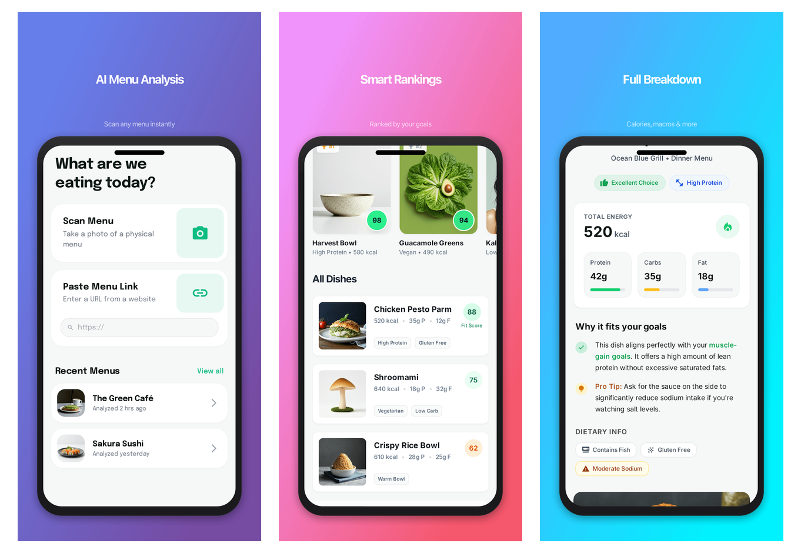
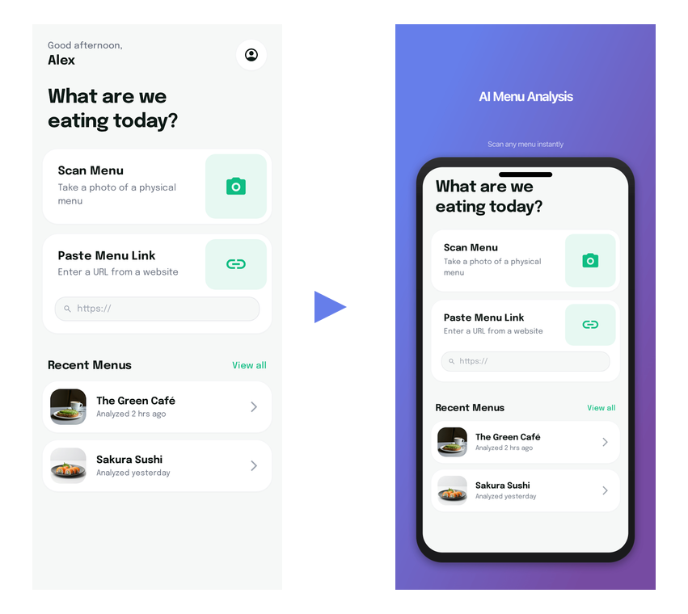

# appshots

Turn raw app screenshots into App Store-ready promotional images — from the CLI.

<p align="center">
  
</p>

## What it does

Take any screenshot from your app and turn it into a polished, store-ready image with one command:

<p align="center">
  
</p>

```bash
npx appshots frame screenshot.png \
  --device iphone-6.9 \
  --background "linear-gradient(135deg, #667eea, #764ba2)" \
  --title "AI Menu Analysis" \
  --subtitle "Ranked by your goals"
```

**appshots** handles three things:

1. **Frame** — wrap raw screenshots in backgrounds, rounded corners, shadows, and text
2. **Capture** — screenshot a running web app at exact device pixel ratios
3. **Validate** — check dimensions, format, and file size against store requirements

26 built-in device presets: iPhone, iPad, Android, Mac, Apple Watch, Apple TV, Vision Pro.

## Install

```bash
npm install -g appshots
```

Or run directly without installing:

```bash
npx appshots frame ./my-screenshots --device iphone-6.9
```

> **Note:** The `capture` command requires Playwright (`npm i -D playwright`). The `frame` and `validate` commands work without it.

## Quick Start

### 1. Frame existing screenshots

You already have screenshots from your simulator, phone, or browser. Make them store-ready:

```bash
# Simple — just resize to exact App Store dimensions
appshots frame ./screenshots --device iphone-6.9

# Promotional — add background gradient and text
appshots frame ./screenshots \
  --device iphone-6.9 \
  --background "linear-gradient(135deg, #667eea, #764ba2)" \
  --title "Your App Name" \
  --subtitle "Your tagline here"

# Solid background
appshots frame ./screenshots --device ipad-13 --background "#1a1a2e" --title "Dashboard"

# Process a single file
appshots frame home.png --device iphone-6.9 -o ./store-ready
```

### 2. Capture from a running web app

Point appshots at your running app and it captures pixel-perfect screenshots:

```bash
# Capture specific pages
appshots capture --url http://localhost:3000 --device iphone-6.9 --path / /features /pricing

# Use a config file for repeatable captures
appshots capture --config appshots.config.ts
```

### 3. Validate before uploading

Check that your screenshots meet App Store / Play Store requirements:

```bash
appshots validate ./screenshots
#   ✓ home.png         1320x2868  (iPhone 6.9")
#   ✓ results.png      1320x2868  (iPhone 6.9")
#   ✗ old-screen.png   1080x1920  → PNG has transparency. App Store requires no transparency.
```

### 4. List device presets

```bash
appshots devices
appshots devices --platform ios
appshots devices --category tablet
```

### 5. Generate a config file

```bash
appshots init
# Creates appshots.config.ts in the current directory
```

## Config File

For repeatable workflows, create an `appshots.config.ts`:

```typescript
import { defineConfig } from 'appshots';

export default defineConfig({
  devices: ['iphone-6.9', 'ipad-13'],

  frame: {
    background: 'linear-gradient(135deg, #667eea, #764ba2)',
    padding: 0.08,
    borderRadius: 0.04,
    titleColor: '#ffffff',
    subtitleColor: 'rgba(255,255,255,0.7)',
    shadow: true,
  },

  capture: {
    baseUrl: 'http://localhost:3000',
    screens: [
      {
        name: 'home',
        path: '/',
        title: 'Welcome Home',
        subtitle: 'Everything you need',
        waitFor: 'Welcome',
      },
      {
        name: 'features',
        path: '/features',
        title: 'Powerful Features',
        delay: 2000,
      },
    ],
  },

  output: './screenshots',
});
```

Also supports `.js`, `.mjs`, and `.json` formats.

## CLI Reference

### `appshots frame <input>`

| Option | Description | Default |
|--------|-------------|---------|
| `-d, --device <slug>` | Target device preset | `iphone-6.9` |
| `-o, --output <dir>` | Output directory | `./screenshots/framed` |
| `-b, --background <value>` | Solid color or CSS gradient | `#000000` |
| `-t, --title <text>` | Title text overlay | — |
| `-s, --subtitle <text>` | Subtitle text overlay | — |
| `--padding <ratio>` | Padding ratio (0–0.4) | `0.08` |
| `--border-radius <ratio>` | Corner radius ratio (0–0.2) | `0.04` |
| `--landscape` | Landscape orientation | — |
| `--no-shadow` | Disable drop shadow | — |
| `--no-device-frame` | Disable device frame bezel | — |
| `-c, --config <path>` | Config file path | — |

### `appshots capture`

| Option | Description | Default |
|--------|-------------|---------|
| `-u, --url <url>` | Base URL of the running app | `http://localhost:3000` |
| `-d, --device <slug>` | Target device preset | `iphone-6.9` |
| `-p, --path <paths...>` | URL paths to capture | — |
| `-o, --output <dir>` | Output directory | `./screenshots` |
| `--landscape` | Landscape orientation | — |
| `-c, --config <path>` | Config file path | — |

### `appshots validate <dir>`

Checks: dimensions, format (PNG/JPEG), transparency, file size (< 10 MB), color space (sRGB).

### `appshots devices`

| Option | Description |
|--------|-------------|
| `--platform <name>` | Filter by platform (`ios`, `android`, `macos`, `watchos`, `tvos`, `visionos`) |
| `--category <name>` | Filter by category (`phone`, `tablet`, `desktop`, `watch`, `tv`, `headset`) |

## Device Presets

| Slug | Dimensions | Devices |
|------|-----------|---------|
| `iphone-6.9` | 1320 x 2868 | iPhone Air, 17 Pro Max, 16 Pro Max |
| `iphone-6.9-alt` | 1290 x 2796 | iPhone 16 Plus, 15 Pro Max |
| `iphone-6.5` | 1284 x 2778 | iPhone 14 Plus, 13 Pro Max |
| `iphone-6.3` | 1206 x 2622 | iPhone 17 Pro, 17 |
| `iphone-6.3-alt` | 1179 x 2556 | iPhone 16 Pro, 16, 15 Pro |
| `iphone-6.1` | 1170 x 2532 | iPhone 14, 13, 12 |
| `iphone-5.5` | 1242 x 2208 | iPhone 8 Plus, 7 Plus |
| `ipad-13` | 2064 x 2752 | iPad Pro M5/M4, iPad Air M3 |
| `ipad-11` | 1668 x 2388 | iPad Pro 11", iPad Air |
| `android-phone` | 1080 x 1920 | Standard Android (16:9) |
| `android-phone-tall` | 1080 x 2400 | Modern Android (20:9) |
| `android-tablet-10` | 1600 x 2560 | 10" Android tablet |
| `mac` | 2880 x 1800 | MacBook Pro |

Run `appshots devices` for all 26 presets including Apple Watch, Apple TV, and Vision Pro.

## Programmatic API

```typescript
import { frameScreenshot, captureScreenshots, validateScreenshots, getDevice } from 'appshots';

// Frame a screenshot
const buffer = await frameScreenshot({
  input: './screenshot.png',
  device: 'iphone-6.9',
  title: 'Welcome',
  options: { background: 'linear-gradient(135deg, #667eea, #764ba2)' },
});

// Get device specs
const spec = getDevice('iphone-6.9');
// { name: 'iPhone 6.9"', width: 1320, height: 2868, dpr: 3, ... }

// Validate a directory
const results = await validateScreenshots('./screenshots');
```

## License

MIT
